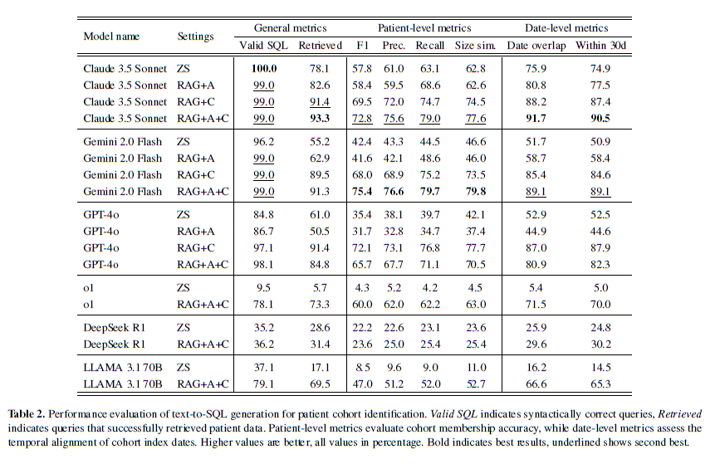
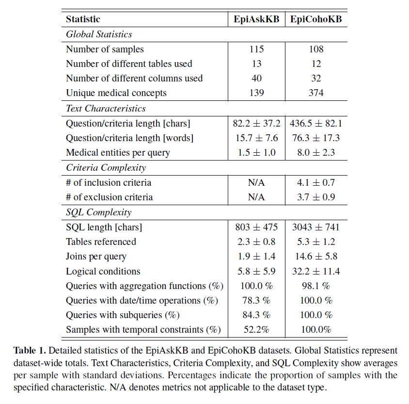

# Generating patient cohorts from electronic health records using two-step retrieval-augmented text-to-SQL generation

This repository contains the implementation of advanced AI systems for automated patient cohort generation from electronic health records and epidemiological question answering.

## 📚 Research Publications

This codebase implements the methods from the following research papers:

**Latest Work (2025) - Accepted at European Conference of Artificial Intelligence (ECAI 2025)**  
International Joint Workshop of Artificial Intelligence for Healthcare and HYbrid Models for Coupling Deductive and Inductive ReAsoning (HC@AIxIA+HYDRA 2025):

```bibtex
@misc{ziletti2025generating,
  title={Generating patient cohorts from electronic health records using two-step retrieval-augmented text-to-SQL generation}, 
  author={Angelo Ziletti and Leonardo D'Ambrosi},
  year={2025},
  eprint={2502.21107},
  archivePrefix={arXiv},
  primaryClass={cs.CL}
}
```

🔗 [Ziletti and D'Ambrosi, Generating patient cohorts from electronic health records using two-step retrieval-augmented text-to-SQL generation (2025)](https://doi.org/10.48550/arXiv.2502.21107)

**Previous Work (2024 - 6th Clinical Natural Language Processing Workshop @ NAACL):**
```bibtex
@inproceedings{ziletti-dambrosi-2024-retrieval,
  title = "Retrieval augmented text-to-{SQL} generation for epidemiological question answering using electronic health records",
  author = "Ziletti, Angelo and D{'}Ambrosi, Leonardo",
  editor = "Naumann, Tristan and Bethard, Steven and Savova, Guergana and Uzuner, Ozlem",
  booktitle = "Proceedings of the 6th Clinical Natural Language Processing Workshop",
  month = jun,
  year = "2024",
  address = "Mexico City, Mexico",
  publisher = "Association for Computational Linguistics",
  url = "https://aclanthology.org/2024.clinicalnlp-1.4",
  pages = "47--53",
}
```

🔗[Ziletti and D'Ambrosi, Retrieval augmented text-to-SQL generation for epidemiological question answering using electronic health records (2024)](https://aclanthology.org/2024.clinicalnlp-1.4/)


## ✨ Features

The system provides two main generative AI-powered capabilities:

### 1. Patient Cohort Generator 

Clinical cohort definition is crucial for patient recruitment in clinical trials and cohort identification in observational studies. The Cohort Generator automates the translation of complex inclusion/exclusion criteria into accurate SQL queries through the following pipeline:


**🔄 Processing Pipeline:**
1. **📝 Criteria Parsing**: Converts raw input cohort criteria into semi-structured definitions
2. **🔍 RAG-Enhanced Processing**: Utilizes two-level Retrieval Augmented Generation (RAG) with:
   - Criteria-specific knowledge base (EpiAskKB)
   - Cohort-level knowledge base (EpiCohortKB)
3. **⚡ Query Generation**: Creates RAG-enhanced instruction prompts for SQL query generation
4. **🏷️ Medical Concept Mapping**: Maps medical concepts to standardized medical coding systems
5. **🗄️ SQL Generation**: Produces verified executable SQL queries for final cohort identification
6. **📊 Patient Funnel**: Generates detailed tracking of inclusion/exclusion steps

**📈 Results:**



For more information, please refer to our [manuscript](https://arxiv.org/pdf/2502.21107).

### 2. Question Answering System 

Enables natural language querying of clinical data by automatically translating questions into SQL queries and generating human-readable answers, based on our previous NAACL Clinical NLP Workshop paper.

This is a re-implementation of our previous [work](https://aclanthology.org/2024.clinicalnlp-1.4/).


**🚀 Key Features:**
- 🗣️ Natural language question processing
- 🔍 RAG-enhanced SQL generation using question-SQL pair knowledge base (EpiAskKB)
- 🏷️ Medical concept mapping to standardized codes
- 💬 Contextual answer generation

## 📊 Knowledge Bases

The system utilizes one SQLite database (`.db` files) containing two specialized knowledge bases:

- **🗃️ EpiAskKB**: Question-SQL pairs for epidemiological question answering
- **🗃️ EpiCohortKB**: Cohort descriptions and corresponding SQL pairs for cohort generation

These knowledge bases enable the RAG-enhanced generation process described in our work.

**📊 Summary Statistics:**


For more information, please refer to the manuscript.

## 🛠️ Installation

### Prerequisites
- Python ≥3.12
- SQLite 3.50.2 or higher 
- [Conda](https://docs.conda.io/en/latest/) (recommended) or venv

### Option 1: Conda (Recommended)

Clone and set up the environment:
```bash
git clone https://github.com/Bayer-Group/epi-cohort-text2sql-ecai2025.git
cd epi-cohort-text2sql-ecai2025
conda create -n ascent-ai python=3.12
conda activate ascent-ai
pip install .
```

### Option 2: Virtual Environment

If you don't want to use conda, you can create a virtual environment using `venv`:

```bash
git clone https://github.com/Bayer-Group/epi-cohort-text2sql-ecai2025.git
cd epi-cohort-text2sql-ecai2025
python3 -m venv ascent-env
source ascent-env/bin/activate  # On Windows use `ascent-env\Scripts\activate`
pip install .
```

### Option 3: Direct Installation

```bash
pip install git+https://github.com/Bayer-Group/epi-cohort-text2sql-ecai2025.git
```

## ⚙️ Configuration

The system requires configuration for:
- AI model endpoints (Claude via AWS Bedrock, GPT via Azure, etc.)
- [Optional] Database connections (if queries are executed)

See `example.env` for configuration template.

## 📁 Project Structure

```
epi-cohort-text2sql-ecai2025/
├── src/ascent_ai/           # 📦 Main package
│   ├── config/              # ⚙️ Configuration management
│   ├── models/              # 🤖 AI models and inference
│   │   ├── inference/       # 🎯 Cohort and QA systems
│   ├── data/                # 🗂️ Data processing utilities
│   ├── db/                  # 🗄️ Database connections
│   └── utils/               # 🔧 Utility functions
├── docs/examples/           # 📋 Usage examples
├── querylib_20250825.db    # 🗃️ Query knowledge base (EpiAskKB and EpiCohortKB)
└── requirements.txt         # 📝 Dependencies
```

## 📋 Examples

This directory contains example implementations of the two main features.

### Cohort Generator

From the root folder of the repository run:
```bash
python docs/examples/example_cohort_generator.py
```

### Question Answering System

From the root folder of the repository run:
```bash
python docs/examples/example_qa_system.py
```

> **ℹ️ Note:** Medical coding is not performed in this code version - we simply return the SQL queries with entity placeholders. 
> For more information on integrating medical coding, see the following repository: https://github.com/Bayer-Group/text-to-sql-epi-ehr-naacl2024

## Contributing

See `CONTRIBUTING.md` for contribution guidelines.

## License

See `LICENSE` file for details.

## Authors

- **Angelo Ziletti** - *Lead Author* 
- **Leonardo D'Ambrosi**

---

*Please cite our work if you use this code in your research. For questions or issues, please contact the authors.*
